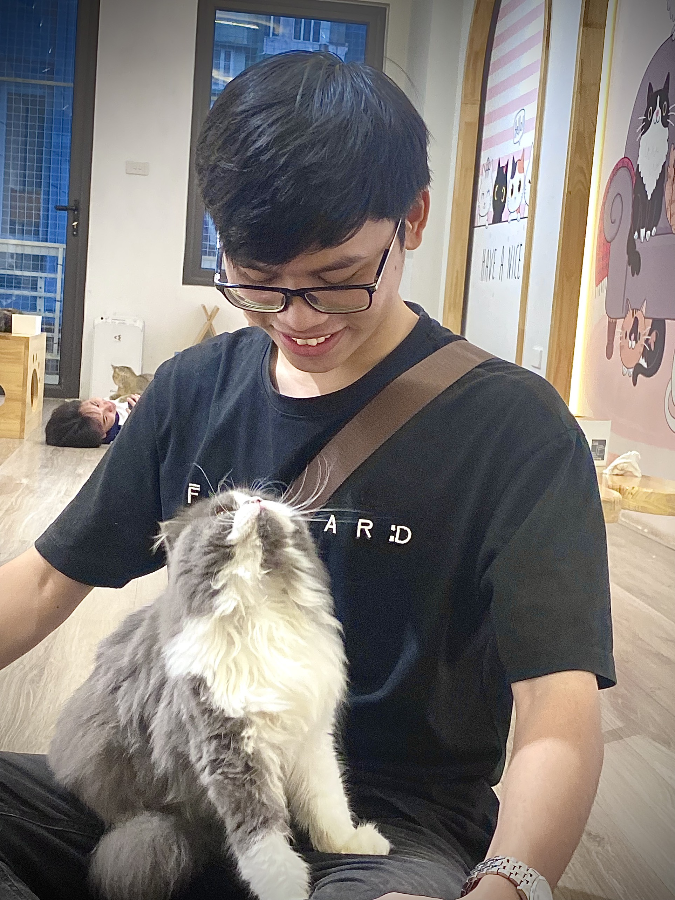

### 👋 Hiii, I’m [@tientai2203](https://github.com/tientai2203)

### About me ...

- :school: I'm a student at **School of Electronics and Electrical Engineering - Hanoi University of Science and Technology**
- :e-mail: Email **nguyentientai223@gmail.com**
- :speech_balloon: Facebook **[Tien Tai](https://www.facebook.com/tai.tien.2203/)**
- :speech_balloon: Linkedin **[Tien Tai](https://www.linkedin.com/in/nguyentientai223/)**

# 💻Tech Stack
    

---

